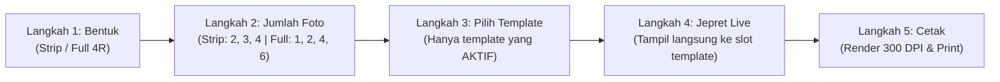

# Dokumentasi Perubahan Sistem Photobooth

Dokumen ini mencatat seluruh pembaruan arsitektur, integrasi modul, perubahan logika antarmuka, dan standarisasi dialog/notifikasi dalam aplikasi **Photobooth**. Dokumen ini berfungsi sebagai referensi teknis berkelanjutan bagi tim pengembang dan administrator sistem.

---

## Daftar Isi
1. [Ringkasan Pembaruan Utama](#1-ringkasan-pembaruan-utama)
2. [Standarisasi Dialog & Konfirmasi: SweetAlert2](#2-standarisasi-dialog--konfirmasi-sweetalert2)
3. [Alur Penggunaan Kiosk (5 Langkah)](#3-alur-penggunaan-kiosk-5-langkah)
4. [Pembaruan Manajemen Template Admin (7 Kategori)](#4-pembaruan-manajemen-template-admin-7-kategori)
5. [Fitur Rotasi Slot Foto (Builder, Preview & Render 300 DPI)](#5-fitur-rotasi-slot-foto-builder-preview--render-300-dpi)
6. [Penguncian Otomatis Ukuran Kertas & Kanvas](#6-penguncian-otomatis-ukuran-kertas--kanvas)
7. [Matriks Detail Perubahan File](#7-matriks-detail-perubahan-file)
8. [Panduan Pemeliharaan & Troubleshooting](#8-panduan-pemeliharaan--troubleshooting)

---

## 1. Ringkasan Pembaruan Utama

1. **Migrasi Dialog ke SweetAlert2**: Menghilangkan seluruh `alert()` dan `confirm()` bawaan browser yang memblokir UI dan tidak responsif, menggantikannya dengan dialog berbasis **SweetAlert2** bertema *Dark Aesthetic Photobooth* (slate/amber/rose).
2. **Penyederhanaan Alur Kiosk**: Menyesuaikan alur kiosk menjadi 5 tahapan terstruktur tanpa distraksi (Bentuk $\rightarrow$ Jumlah Foto $\rightarrow$ Template Aktif $\rightarrow$ Jepret Live Slot $\rightarrow$ Cetak Resolusi Tinggi 300 DPI). Filter wajah & pengubah background dinonaktifkan demi kecepatan operasional kiosk.
3. **Pemisahan Tabel Template Admin**: Memecah halaman manajemen template menjadi 7 tabel kategori terpisah berdasarkan Bentuk (Strip/Full) dan Jumlah Foto (2, 3, 4, 1, 2, 4, 6) dengan aksi cepat "+ Tambah Desain" berbasis preset dan tombol "Ubah".
4. **Dukungan Rotasi Slot Foto**: Memungkinkan desainer memutar slot foto secara bebas (derajat arbitrer atau tombol cepat 0°, 90°, 180°, 270°, ±15°) di Builder, tampil presisi secara real-time pada kanvas kiosk, dan dicetak sempurna pada resolusi 300 DPI via PHP GD (`imagerotate`).
5. **Penguncian Otomatis Ukuran Kertas & Kanvas**: Opsi pemilihan ukuran kertas dan kanvas dihilangkan dari antarmuka Builder. Format Strip terkunci permanen pada rasio 1:3 (600x1800 px) dengan preset 2, 3, 4 foto, dan Full 4R terkunci permanen pada rasio 2:3 (1200x1800 px) dengan preset 1, 2, 4, 6 foto. Keduanya diisolasi penuh sehingga tidak dapat saling tertukar.

---

## 2. Standarisasi Dialog & Konfirmasi: SweetAlert2

### 2.1. Helper Terpusat (`resources/js/utils/swal.ts`)
Dibuat modul pembungkus (wrapper) SweetAlert2 dengan gaya terpadu yang konsisten dengan palet tema kiosk:
- **Background**: `#0f172a` (Slate 900)
- **Aksen Border**: `#334155` (Slate 700)
- **Teks**: `#f8fafc` (Slate 50) dengan font Poppins
- **Tombol Konfirmasi**: `#f59e0b` (Amber Gold) atau `#ef4444` (Rose/Red untuk tindakan destruktif)
- **Tombol Batal**: `#475569` (Slate 600)

### 2.2. Fungsi-fungsi Helper yang Tersedia
```typescript
import {
  showSuccess,      // Notifikasi berhasil (SweetAlert Modal)
  showError,        // Notifikasi gagal/error
  showWarning,      // Peringatan ke pengguna
  showInfo,         // Informasi umum
  showConfirm,      // Dialog konfirmasi (Yes / No)
  showDeleteConfirm,// Dialog konfirmasi hapus khusus (Merah)
  showToast         // Notifikasi toast ringan di sudut layar (top-end)
} from '@/utils/swal';
```

---

## 3. Alur Penggunaan Kiosk (5 Langkah)

Alur kiosk kini berfokus pada pengalaman pengguna yang cepat, mulus, dan intuitif:



1. **Langkah 1: Pilih Bentuk**
   - Pengguna memilih format kertas cetak:
     - **Strip**: Cetak format photostrip panjang (setengah kertas 4R, 2"x6" atau 600x1800 px).
     - **Full**: Cetak format foto penuh satu kertas (4"x6" atau 1200x1800 px).
2. **Langkah 2: Pilih Jumlah Foto**
   - Jika bentuk **Strip**: Pilihan 2 Foto, 3 Foto, atau 4 Foto.
   - Jika bentuk **Full**: Pilihan 1 Foto, 2 Foto, 4 Foto, atau 6 Foto.
3. **Langkah 3: Pilih Desain / Template**
   - Menampilkan daftar kartu desain template yang telah disiapkan admin.
   - Hanya template dengan status **Aktif (`is_active = true`)** yang sesuai dengan kombinasi bentuk dan jumlah foto yang dimunculkan.
4. **Langkah 4: Jepret Foto Live**
   - Kamera aktif secara langsung di dalam komposisi kanvas template (`LiveTemplateCanvas.vue`).
   - Setiap jepretan otomatis mengisi slot foto aktif secara berurutan dengan animasi countdown dan flash.
   - Slot foto yang memiliki orientasi rotasi akan menampilkan preview kamera dan foto tersimpan dengan rotasi yang sama.
5. **Langkah 5: Konfirmasi & Cetak**
   - Menampilkan hasil akhir komposit foto.
   - Mengirim permintaan render komposit backend resolusi tinggi (300 DPI) ke printer photobooth dan menghasilkan QR Code download foto digital.

---

## 4. Pembaruan Manajemen Template Admin (7 Kategori)

Halaman indeks admin (`/admin/templates`) telah dirombak dari satu tabel bercampur menjadi **7 kategori tabel independen** tanpa penomoran redundan:

| No | Nama Kategori Tabel | Format Kertas | Jumlah Slot Foto | Ukuran Kanvas Dasar |
|---|---|---|---|---|
| 1 | **Strip 2 Foto** | Strip (Setengah 4R) | 2 Slot | 600 × 1800 px |
| 2 | **Strip 3 Foto** | Strip (Setengah 4R) | 3 Slot | 600 × 1800 px |
| 3 | **Strip 4 Foto** | Strip (Setengah 4R) | 4 Slot | 600 × 1800 px |
| 4 | **Full 1 Foto** | Full (4R Penuh) | 1 Slot | 1200 × 1800 px |
| 5 | **Full 2 Foto** | Full (4R Penuh) | 2 Slot | 1200 × 1800 px |
| 6 | **Full 4 Foto** | Full (4R Penuh) | 4 Slot | 1200 × 1800 px |
| 7 | **Full 6 Foto** | Full (4R Penuh) | 6 Slot | 1200 × 1800 px |

### Fitur Interaktif pada Tabel Admin:
- **Tombol "+ Tambah Desain"**: Membuka halaman Template Builder dengan parameter preset otomatis (misal: `?preset=strip-2`, `?preset=full-4`), sehingga kanvas dan slot default langsung terisi secara proporsional.
- **Tombol "Ubah"**: Membuka template yang sudah ada ke dalam Builder untuk pengeditan grafis, tata letak, rotasi foto, layer teks, stiker, dan background.
- **Toggle Status Aktif/Nonaktif**: Tombol saklar switch instan untuk mengontrol apakah template dapat dipilih pelanggan di kiosk atau disembunyikan.
- **Tombol Hapus dengan Konfirmasi**: Dilindungi modal konfirmasi SweetAlert2 sebelum memicu penghapusan rekaman basis data.

---

## 5. Fitur Rotasi Slot Foto (Builder, Preview & Render 300 DPI)

Setiap elemen bertipe `photo_slot` pada kanvas kini mendukung parameter `rotation` (dalam derajat sudut, misal `0`, `90`, `-15`, `45`, `180`):

### 5.1. Template Builder (`Builder.vue`)
- Panel konfigurasi elemen foto menyediakan kontrol rotasi interaktif:
  - Tombol cepat rotasi: `0°`, `90°`, `180°`, `270°`
  - Tombol penyesuaian halus: `-15°` dan `+15°`
  - Slider interaktif: `-180°` s/d `180°`
  - Input angka derajat manual untuk presisi tinggi.

### 5.2. Live Canvas Kiosk (`LiveTemplateCanvas.vue`)
- Slot foto menggunakan transformasi CSS:
  ```css
  transform: rotate(${element.rotation || 0}deg);
  transform-origin: center center;
  ```
- Kamera aktif yang sedang bersiap mengambil gambar pada slot tersebut maupun foto yang telah terkunci dirender mengikuti rotasi yang ditentukan.

### 5.3. Backend Composer 300 DPI (`PhotoComposer.php`)
- PHP GD menggunakan fungsi `imagerotate($slotCanvas, -$rotation, $transparent)`.
- Penggunaan nilai minus (`-$rotation`) menjamin orientasi hasil cetak identik 100% dengan tampilan di layar kiosk.
- Bounding box setelah rotasi dihitung ulang agar titik pusat foto tetap berada di tengah koordinat slot yang telah dirancang admin.

---

## 6. Penguncian Otomatis Ukuran Kertas & Kanvas

Berdasarkan kebutuhan operasional photobooth, ukuran kertas dan kanvas tidak lagi diizinkan untuk diubah-ubah secara manual di dalam Builder demi mencegah kerusakan komposisi layout dan ketidaksesuaian resolusi cetak printer.

### 6.1. Aturan Penguncian (Locking Rules)
1. **Format Strip (Setengah 4R)**:
   - Terkunci permanen pada resolusi cetak **600 × 1800 px (300 DPI)**.
   - Kanvas visual di Builder terkunci pada dimensi **210px × 630px** (aspek rasio 1:3).
   - Opsi slot preset yang disediakan hanya **2 Foto**, **3 Foto**, dan **4 Foto**.
   - Pengguna **TIDAK BISA** mengubah ukuran menjadi Full atau ukuran kertas lain.
2. **Format Full 4R (4R Utuh)**:
   - Terkunci permanen pada resolusi cetak **1200 × 1800 px (300 DPI)**.
   - Kanvas visual di Builder terkunci pada dimensi **360px × 540px** (aspek rasio 2:3).
   - Opsi slot preset yang disediakan hanya **1 Foto**, **2 Foto**, **4 Foto**, dan **6 Foto**.
   - Pengguna **TIDAK BISA** mengubah ukuran menjadi Strip atau ukuran kertas lain.

### 6.2. Elemen UI yang Dihilangkan & Digantikan
- **Dropdown "Ukuran Kertas & Kanvas" Dihilangkan**: Input select yang sebelumnya berisi opsi `Strip 2x6`, `4R`, `5R`, `6R`, `A4` telah sepenuhnya dihapus dari toolbox sebelah kiri.
- **Badge Status Terkunci**: Ditambahkan badge dengan ikon gembok (`Lock`) pada bar kontrol atas dan sidebar toolbox yang menerangkan format kanvas yang sedang aktif dan terkunci.
- **Tombol Tambah Spesifik pada Index**: Tombol ambigu "BUKA VISUAL BUILDER BARU" pada halaman Index Admin digantikan oleh dua tombol spesifik: **`+ Desain Strip`** dan **`+ Desain Full 4R`**, sehingga setiap pembuatan desain baru selalu diawali dengan format yang jelas dan terkunci sejak awal.

---

## 7. Matriks Detail Perubahan File

Berikut adalah daftar lengkap berkas yang telah diperbarui atau ditambahkan beserta rincian fungsionalnya:

### 7.1. File Frontend (Vue 3, Pinia, TypeScript)

| File | Status | Keterangan Perubahan |
|---|---|---|
| [`resources/js/Pages/Admin/Templates/Builder.vue`](file:///D:/PROGRAMER/WEB/photo/resources/js/Pages/Admin/Templates/Builder.vue) | **Diperbarui** | Menghilangkan dropdown pilihan ukuran kertas dan kanvas, mengunci kanvas dan paperSize secara otomatis ke format Strip (600x1800) atau Full 4R (1200x1800), mengisolasi tombol preset hanya untuk format yang aktif, menambahkan indikator ikon gembok `Lock`, memperbaiki inisialisasi default slot foto (`paperSize.value`), dan kontrol rotasi foto. |
| [`resources/js/Pages/Admin/Templates/Index.vue`](file:///D:/PROGRAMER/WEB/photo/resources/js/Pages/Admin/Templates/Index.vue) | **Diperbarui** | Merestrukturisasi halaman menjadi 7 tabel kategori template, tombol "+ Tambah Desain", tombol "Ubah", tombol cepat header `+ Desain Strip` dan `+ Desain Full 4R`, serta migrasi dialog konfirmasi ke SweetAlert2. |
| [`resources/js/utils/swal.ts`](file:///D:/PROGRAMER/WEB/photo/resources/js/utils/swal.ts) | **Baru** | Modul helper SweetAlert2 dengan custom styling Photobooth Dark Theme (`showSuccess`, `showError`, `showConfirm`, dll). |
| [`resources/js/Pages/Kiosk/Camera.vue`](file:///D:/PROGRAMER/WEB/photo/resources/js/Pages/Kiosk/Camera.vue) | **Diperbarui** | Menghubungkan alur jepretan live langsung ke slot template aktif (`LiveTemplateCanvas.vue`), mengganti `confirm()` restart dan `alert()` error cetak dengan SweetAlert2, menonaktifkan filter wajah dan background picker manual. |
| [`resources/js/Components/LiveTemplateCanvas.vue`](file:///D:/PROGRAMER/WEB/photo/resources/js/Components/LiveTemplateCanvas.vue) | **Diperbarui** | Merender slot foto dengan orientasi rotasi dinamis (`rotate(Xdeg)`), mendukung streaming video kamera pada slot aktif dengan rasio aspek cover. |
| [`resources/js/Components/FrameSelectorModal.vue`](file:///D:/PROGRAMER/WEB/photo/resources/js/Components/FrameSelectorModal.vue) | **Diperbarui** | Menggantikan konfirmasi hapus frame dan notifikasi simpan dengan SweetAlert2. |
| [`resources/js/Components/PaymentModal.vue`](file:///D:/PROGRAMER/WEB/photo/resources/js/Components/PaymentModal.vue) | **Diperbarui** | Mengganti peringatan kegagalan proses pembayaran dengan `showError()`. |
| [`resources/js/Pages/Admin/Events/Index.vue`](file:///D:/PROGRAMER/WEB/photo/resources/js/Pages/Admin/Events/Index.vue) | **Diperbarui** | Mengganti konfirmasi aktivasi/penghapusan event dengan SweetAlert2. |
| [`resources/js/Pages/Admin/Promos/Index.vue`](file:///D:/PROGRAMER/WEB/photo/resources/js/Pages/Admin/Promos/Index.vue) | **Diperbarui** | Mengganti feedback penyimpanan dan penghapusan kupon diskon/promo dengan SweetAlert2. |
| [`resources/js/Pages/Admin/Settings/Index.vue`](file:///D:/PROGRAMER/WEB/photo/resources/js/Pages/Admin/Settings/Index.vue) | **Diperbarui** | Mengganti konfirmasi penyimpanan pengaturan printer, hardware, dan sistem dengan SweetAlert2. |
| [`resources/js/Pages/Kiosk/Index.vue`](file:///D:/PROGRAMER/WEB/photo/resources/js/Pages/Kiosk/Index.vue) | **Diperbarui** | Mengganti peringatan validasi sesi mulai kiosk dengan `showError()`. |
| [`resources/js/Pages/Kiosk/TemplateSelect.vue`](file:///D:/PROGRAMER/WEB/photo/resources/js/Pages/Kiosk/TemplateSelect.vue) | **Diperbarui** | Menampilkan template sesuai filter bentuk & jumlah foto, dialog peringatan jika belum memilih template menggunakan SweetAlert2. |
| [`resources/js/Pages/Controller/Index.vue`](file:///D:/PROGRAMER/WEB/photo/resources/js/Pages/Controller/Index.vue) | **Diperbarui** | Mengganti seluruh konfirmasi remote shutter controller dengan SweetAlert2. |
| [`resources/js/Pages/Download/Index.vue`](file:///D:/PROGRAMER/WEB/photo/resources/js/Pages/Download/Index.vue) | **Diperbarui** | Mengganti toast informasi unduhan dengan `showToast()` dari SweetAlert2. |
| [`resources/js/stores/sessionStore.ts`](file:///D:/PROGRAMER/WEB/photo/resources/js/stores/sessionStore.ts) | **Diperbarui** | Mengintegrasikan penanganan error sesi via `showError()` SweetAlert2. |

### 7.2. File Backend (Laravel, PHP, Routes)

| File | Status | Keterangan Perubahan |
|---|---|---|
| [`app/Http/Controllers/Admin/TemplateController.php`](file:///D:/PROGRAMER/WEB/photo/app/Http/Controllers/Admin/TemplateController.php) | **Diperbarui** | Menyimpan properti `rotation` pada slot foto, menangani route query `preset`, menyediakan endpoint toggle status aktif (`/admin/templates/{id}/toggle`), dan destroy template. |
| [`app/Services/Composer/PhotoComposer.php`](file:///D:/PROGRAMER/WEB/photo/app/Services/Composer/PhotoComposer.php) | **Diperbarui** | Menambahkan pipeline rotasi GD (`imagerotate`) pada komposit foto slot 300 DPI, penyesuaian titik jangkar (anchor point) tengah slot, dan penanganan transparansi PNG. |
| [`routes/web.php`](file:///D:/PROGRAMER/WEB/photo/routes/web.php) | **Diperbarui** | Mendaftarkan route `POST /admin/templates/{id}/toggle` dan memastikan route resource template mendukung aksi CRUD penuh. |
| [`package.json`](file:///D:/PROGRAMER/WEB/photo/package.json) | **Diperbarui** | Menambahkan dependensi `sweetalert2` versi terbaru. |

---

## 8. Panduan Pemeliharaan & Troubleshooting

### 8.1. Menjalankan Kompilasi Aset
Setelah melakukan perubahan pada berkas Vue, CSS, atau TypeScript, jalankan kompilasi:
```powershell
# Mode Development (Hot Module Replacement)
npm run dev

# Mode Produksi (Build Minified Assets)
npm run build
```

### 8.2. Membersihkan Cache Laravel
Jika ada penambahan rute atau konfigurasi baru:
```powershell
php artisan route:clear
php artisan config:clear
php artisan view:clear
```

### 8.3. Menambah Variasi Template Baru
1. Masuk ke panel admin: `http://localhost:8000/admin/templates`.
2. Temukan tabel kategori yang sesuai (misal: "Strip 3 Foto").
3. Klik tombol **"+ Tambah Desain"** pada baris header kategori tersebut (atau tombol `+ Desain Strip` / `+ Desain Full 4R` di bagian atas).
4. Canvas akan otomatis terkonfigurasi dan terkunci dengan ukuran yang sesuai (tidak dapat tertukar antara Strip dan Full).
5. Unggah background atau bingkai frame overlay PNG transparan, atur posisi & rotasi foto, tambahkan stiker atau teks, lalu klik **"SIMPAN DESAIN"**.
6. Pastikan switch status template berada pada posisi **Aktif** agar langsung muncul di layar Kiosk pengguna.
